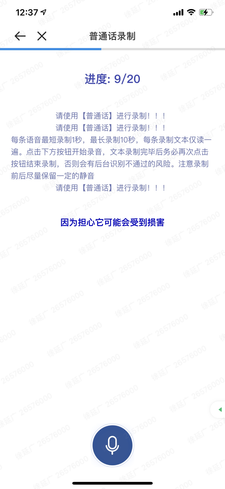

Volunteers had to sign an agreement for open-sourcing their speech for academic usage before further recording, as described in the paper.

The agreement provided by the company's legal department is in Chinese as follows:

> 尊敬的经纪人：
> 
> 感谢您支持参与本次活动。经您授权同意并进入活动页面后，我们可能请求您提交如下个人信息：您所擅长的汉语方言类型，您输入的汉语方言常见表达的文本信息，您朗读我们指定文本的语音信息（可能包括您的声纹信息）。同时，在收集您的声音信息时，我们可能需要开启您的设备的麦克风权限。
> 
> 除非适用法律法规另有规定、有权机关之命令或者另行获取您的授权同意，我们仅会将您参与本次活动所提交的前述个人信息投入下述非盈利用途：贝壳平台内部的学术研究和技术研发活动；作为开源语料数据集的组成部分，向科研机构开放以供学术研究或算法竞赛；且我们将要求前述科研机构在获取数据集（微量样例数据除外）之前先行签订许可协议。但是，我们不会将您参与本次活动所提交的前述个人信息与其他足以识别或关联您身份的个人信息共同存储或使用。
> 
> 如果您已仔细阅读并充分理解前述条款，且自愿参与本次活动，请点击下方“同意”按钮。

The key points involved in the agreement are:
* What volunteers need to know before further recording
  - The audio MAY include voiceprint information.
  - Won't store or use any information that can be related or tracked to a specific person.
  - Press the 'agree' button voluntarily to proceed or EXIT.
* What to do for volunteers
  - Give microphone permission during recording.
  - Select a city where the volunteer is good at the dialect.
  - Read the predefined text with Mandarin/Mandarin dialect.
* Data usage
  - Non-commercial.
  - Academic open-sourcing or challenge.
  - By Beike internal legally.
  - By other academic institutions via signing a license, except small sample.

The agreement interface presented to the volunteers on mobile phone:

The recording interface after the agreement:

